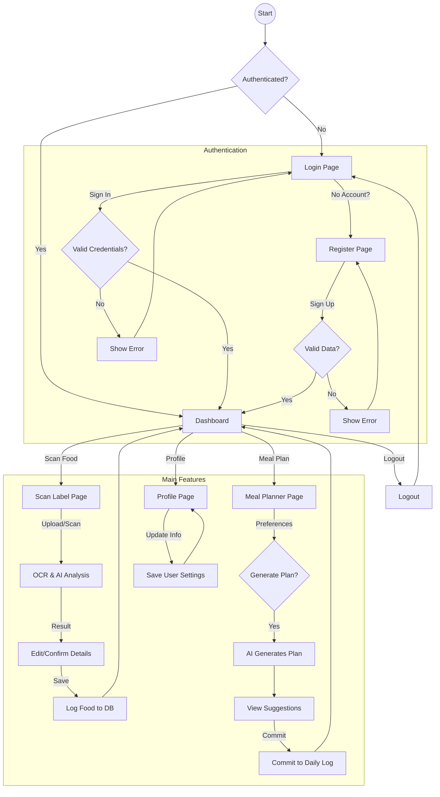

# Smart Nutrition System - User Flow Chart

```mermaid
flowchart TD
    start((Start)) --> checkAuth{Authenticated?}
    
    checkAuth -- No --> LoginPag[Login Page]
    checkAuth -- Yes --> Dashboard[Dashboard]

    subgraph Auth [Authentication]
        LoginPag --> |"Sign In"| LoginAction{Valid Credentials?}
        LoginPag --> |"No Account?"| RegisterPag[Register Page]
        RegisterPag --> |"Sign Up"| RegisterAction{Valid Data?}
        
        LoginAction -- No --> LoginError[Show Error] --> LoginPag
        LoginAction -- Yes --> Dashboard
        
        RegisterAction -- No --> RegisterError[Show Error] --> RegisterPag
        RegisterAction -- Yes --> Dashboard
    end

    subgraph Main [Main Features]
        Dashboard --> |"Scan Food"| ScanPage[Scan Label Page]
        Dashboard --> |"Meal Plan"| PlanPage[Meal Planner Page]
        Dashboard --> |"Profile"| ProfilePage[Profile Page]
        
        ScanPage --> |"Upload/Scan"| OCRProcessing[OCR & AI Analysis]
        OCRProcessing --> |"Result"| EditFood[Edit/Confirm Details]
        EditFood --> |"Save"| SaveLog[Log Food to DB]
        SaveLog --> Dashboard
        
        PlanPage --> |"Preferences"| GenPlan{Generate Plan?}
        GenPlan -- Yes --> AIPlan[AI Generates Plan]
        AIPlan --> ViewPlan[View Suggestions]
        ViewPlan --> |"Commit"| CommitPlan[Commit to Daily Log]
        CommitPlan --> Dashboard
        
        ProfilePage --> |"Update Info"| SaveProfile[Save User Settings]
        SaveProfile --> ProfilePage
    end

    Dashboard --> |"Logout"| Logout[Logout]
    Logout --> LoginPag
```
