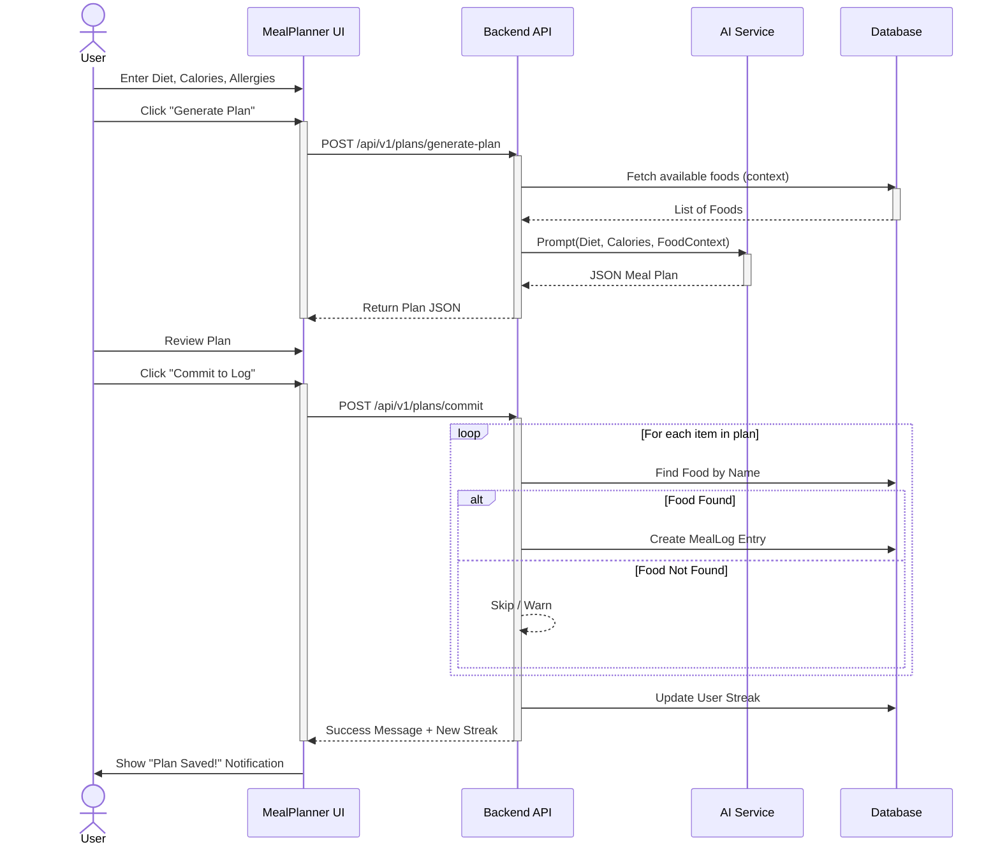

# Smart Nutrition System - Sequence Diagram (Meal Plan)

```mermaid
sequenceDiagram
    actor User
    participant UI as MealPlanner UI
    participant API as Backend API
    participant LLM as AI Service
    participant DB as Database

    User->>UI: Enter Diet, Calories, Allergies
    User->>UI: Click "Generate Plan"
    
    activate UI
    UI->>API: POST /api/v1/plans/generate-plan
    activate API
    
    API->>DB: Fetch available foods (context)
    activate DB
    DB-->>API: List of Foods
    deactivate DB
    
    API->>LLM: Prompt(Diet, Calories, FoodContext)
    activate LLM
    LLM-->>API: JSON Meal Plan
    deactivate LLM
    
    API-->>UI: Return Plan JSON
    deactivate API
    deactivate UI

    User->>UI: Review Plan
    User->>UI: Click "Commit to Log"
    
    activate UI
    UI->>API: POST /api/v1/plans/commit
    activate API
    
    loop For each item in plan
        API->>DB: Find Food by Name
        alt Food Found
            API->>DB: Create MealLog Entry
        else Food Not Found
            API-->>API: Skip / Warn
        end
    end
    
    API->>DB: Update User Streak
    API-->>UI: Success Message + New Streak
    deactivate API
    deactivate UI
    
    UI->>User: Show "Plan Saved!" Notification
```
